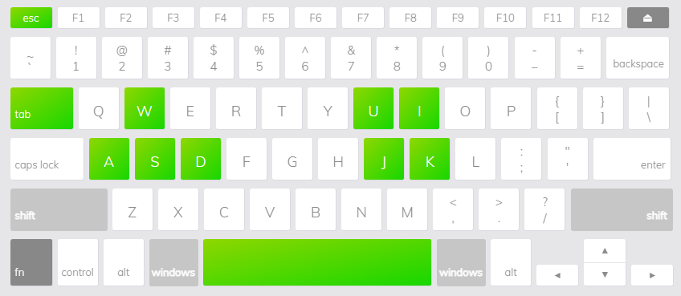

# Office Politics
Congratulations on your new internship! Unfortunately, the Job Description was a lie. Ha ha.

Office Politics is a single ~~player~~ intern top-down 2D action game where you’ll try to get through each day no matter what your bosses *throw* at you. Complete the **Tasks**, dodge the **Arrows**, and don’t let work pile up… or you might get stressed out!

## System requirements
- Windows
- Mouse and Keyboard

## Maybe some screenshots or gif is great

### Controls
- **WASD** for player movement.
- **J**  to interact.
    - If the Player is holding an object, they cannot interact with anything except the appropriate receivable until they put it down.
    - The Player is not allowed to drop the item on the floor.
- **Direction + Space** to Dash.
    - Moves the Player in a specific direction for a set distance quickly. 
    - Gives no invincibility frames, just quicker movement. 
    - Is on a short cooldown

- **Space** to Parry.
    - Deflects any projectile within a set distance from the player.
    - Activates a short delay after pressing the button.
    - Active for a short duration, after which the player will be put into recovery.
    - Arrows will not be deflected if the player is hit during the startup or recovery time of the parry, instead the arrow will hit the player.
    
- **U, I** to use the currently selected Consumable in slot 1 or slot 2, respectively.

- **K** to cycle between Consumables.
- **Mouse 1** click to select menu buttons.

### Gameplay

A link to your gameplay recording video

### Other information

